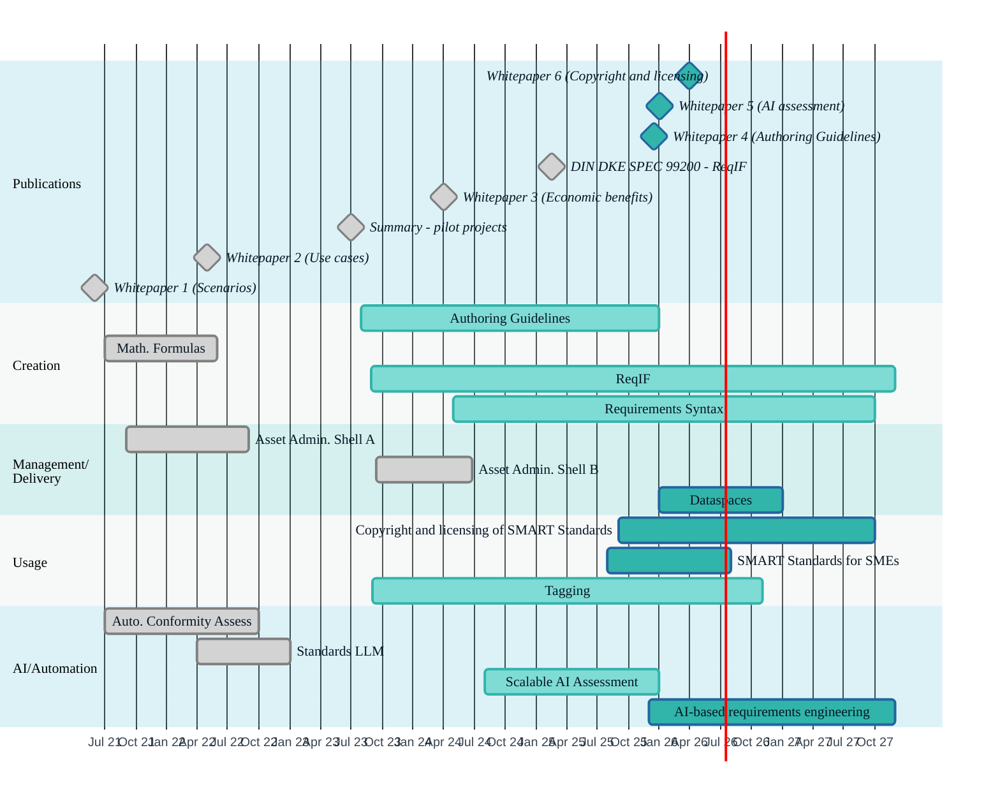

# IDiS Roadmap

The following chart shows a timeline of completed, ongoing and planned working groups and publications that are part of the Initiative on Digital Standards (IDiS) by DIN & DKE. In the chart, working groups are mapped to a phase in the value creation process of digital standards (see [whitepaper 1](https://www.dke.de/resource/blob/2272802/facc9bde1806e2194a3d26a60c79bf77/idis-whitepaper-1-en---download-data.pdf)), with a special section for AI-related groups. The table below the chart provides further details.

| **Element**                                       | **Status** | **Timeframe**    | **Description**                                                                                  | **Link**                                                                                                                                                 |
| ------------------------------------------------- | ------- | -------------------- | ------------------------------------------------------------------------------------------------ | ---------------------------------------------------------------------------------------------------------------------------------------------------- |
| Group: SMART Standards for SMEs                   | 🕑      | planned for 2026     | Use SME-specific tools (self-assessments, templates) to lower entry barriers for SMART Standards | tba                                                                                                                                                  |
| Group: Copyright and licensing of SMART Standards | 🕑      | planned for 2026     | How can transparent use and licensing of standards be ensured?                                   | tba                                                                                                                                                  |
| Group: Dataspaces                                 | 🕑      | planned for 2026     | Serve the cross-sectoral networking of data spaces in order to provide SMART Standards           | tba                                                                                                                                                  |
| Group: AI-based requirement engineering           | 🕑      | planned for 11/2025 – 10/2026  | Improvement of AI-based requirements engineering using SMART Standards                           | tba                                                                                                                                                  |
| Whitepaper 5: Scalable AI Assessment              | 🕑      | planned for 01/2026   | Scalable AI assessment with SMART Standards                                       | [Project page](https://www.dke.de/idis/pilotprojekte/smart-standards-fuer-skalierbare-ki-pruefung)                                                   |
| Whitepaper 4: Authoring guidelines                | 🕑      | planned for 12/2025 | Authoring guidelines for provisions ("Redaktionsrichtlinien") to enhance (machine-) readability of standards                            | tba                                                                                                                                                  |
| Group: Requirement Syntax                         | 🏃      | running 05/2024 - 10/2026 | Syntax rules for machine-readable normative requirements                                         | tba                                                                                                                                                  |
| Group: Scalable AI Assessment (SKIP)              | 🏃      | running 11/2024 - 11/2025 | AI-based automated conformity checking for SMART Standards                                       | [Project page](https://www.dke.de/idis/pilotprojekte/smart-standards-fuer-skalierbare-ki-pruefung)                                              
| Group: Tagging                                    | 🏃      | running 09/2023 - 11/2026 | Making relevant requirements and information findable via tags                              | tba |
| Group: Authoring Guidelines                       | 🏃      | running 08/2023 - 12/2025    | Authoring guidelines for provisions ("Redaktionsrichtlinien")                               | tba                                                                                                                                                  |
| Group: ReqIF                                      | 🏃      | running since 08/2023        | ReqIF™ interpretation for public standards - group ongoing for further improvements      | [Github](https://github.com/DIN-DKE/DIN_DKE_SPEC_99200__ReqIF_interpretation_for_public_standards),[presentation](https://www.dke.de/resource/blob/2385870/a9a4514d6c2ac754eb2a0a6af93f0ef7/idis-13-03d-adhoc-reqif--en--andreas-wernicke-data.pdf) |
| DIN DKE SPEC 99200 (ReqIF)                        | ✅      | completed Feb 2025   | ReqIF™ interpretation for public standards                                               | [Github](https://github.com/DIN-DKE/DIN_DKE_SPEC_99200__ReqIF_interpretation_for_public_standards), [presentation](https://www.dke.de/resource/blob/2385870/a9a4514d6c2ac754eb2a0a6af93f0ef7/idis-13-03d-adhoc-reqif--en--andreas-wernicke-data.pdf), [official website](https://www.din.de/en/wdc-beuth:din21:389211467)                                                   |
| Whitepaper 3: Benefits of SMART Standards         | ✅      | completed Apr 2024   | Economic impact and value of SMART Standards                                                     | [Download whitepaper](https://www.dke.de/resource/blob/2349926/07fde5efcf4e2b83d6d4c82816a0cef3/din-dke-a4-whitepaper-iii-en-data.pdf)               |
| Management summary: Pilots                        | ✅      | completed Jul 2023   | Pilot projects: Standards-based Language Model, SMART Standards based on factory standardization and requirements engineering, Automated conformity assessment, Standard integration in the Asset Administration Shell                     | [Management summary](https://www.dke.de/resource/blob/2270870/b7e31f5d486bf286eeb9e5cd08fc27b8/piloten-2022-management-summary-en---download-data.pdf)                                                                                                 | [Download Summary](https://www.dke.de/resource/blob/2270870/b7e31f5d486bf286eeb9e5cd08fc27b8/piloten-2022-management-summary-en---download-data.pdf) |
| Whitepaper 2: Use Cases                           | ✅      | completed May 2022   | 11 practical use cases for SMART Standards                                                       | [Download whitepaper](https://www.dke.de/resource/blob/2272806/33ab0714368ab3cbb4ebe8614f2b065a/idis-whitepaper-2-en---download-data.pdf)            |
| Whitepaper 1: Scenarios for digitalization        | ✅      | completed Jun 2021   | Digitalization scenarios and maturity levels for standards                                       | [Download whitepaper](https://www.dke.de/resource/blob/2272802/facc9bde1806e2194a3d26a60c79bf77/idis-whitepaper-1-en---download-data.pdf)            |
| Group: Asset Administration Shell B               | ✅      | completed 2024       | Integration of standard content as AASX (Asset Administration Shell)                             | [Project page](https://www.dke.de/idis/pilotprojekte/normintegration-in-die-verwaltungsschale/normintegration-in-die-verwaltungsschale-b)            |
| Group: Asset Administration Shell A               | ✅      | completed 2022       | Integration of standard content as AASX (Asset Administration Shell)                             | [Project page](https://www.dke.de/idis/pilotprojekte/normintegration-in-die-verwaltungsschale/normintegration-in-die-verwaltungsschale-a)            |
| Group: Math. Fomulas                              | ✅      | completed 2023       | Structuring, extracting, linking, and making formulas in standards machine-readable.         | [Project Page](https://www.dke.de/idis/pilotprojekte/formelprojekt)                                                                                  |
| Group: Standards-based Language Model             | ✅      | completed 2023       | Pilot on training a foundation model with standards | See [management summary](https://www.dke.de/resource/blob/2270870/b7e31f5d486bf286eeb9e5cd08fc27b8/piloten-2022-management-summary-en---download-data.pdf) |
| Group: Automated Conformity Assesment             | ✅      | completed 2023       | Automating conformity assessment using machine-readable standards and integrated measurement.    | [Project Page](https://www.dke.de/idis/pilotprojekte/konformitaetspruefung)                                                                          |
