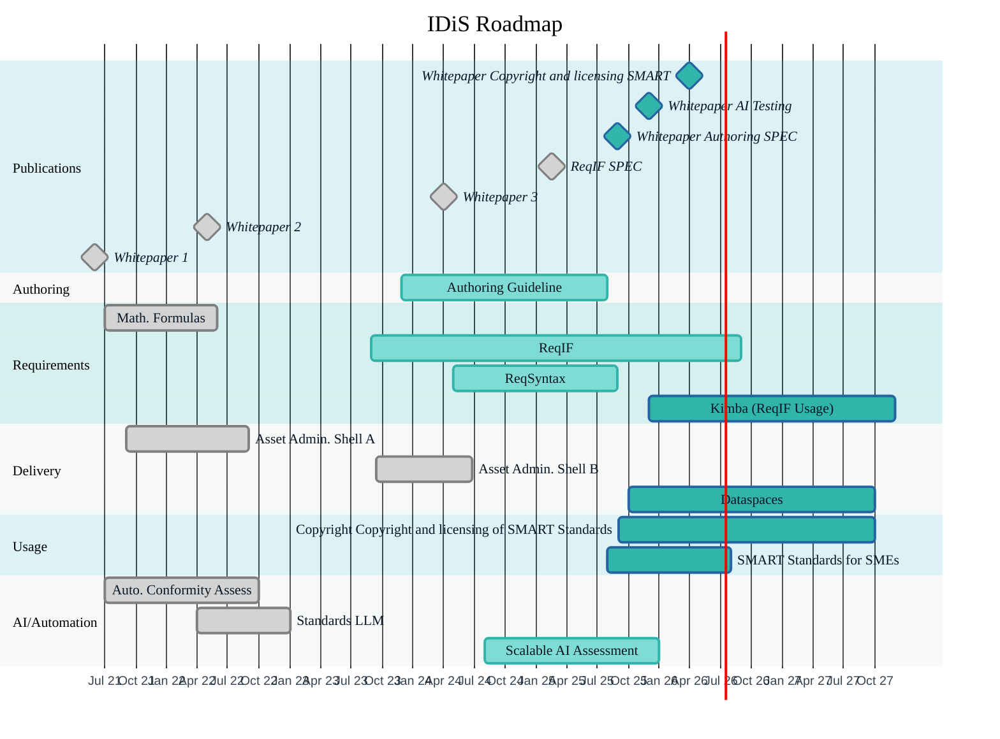

| Element                   | Timeframe              | Description                                                              | Link                                                                                   |
|---------------------------|------------------------|--------------------------------------------------------------------------|----------------------------------------------------------------------------------------|
| **Authoring SPEC**        | until Apr 2025         | Specification for structured, machine-readable authoring of standards    | [dke.de/idis](https://www.dke.de/idis)                                                 |
| **ReqIF SPEC**            | completed Feb 2025     | Definition of requirements exchange format (ReqIF)                       | [Github](https://github.com/DIN-DKE/DIN_DKE_SPEC_99200__ReqIF_interpretation_for_public_standards) |
| **Whitepaper 3**          | completed Apr 2024     | Economic impact and value of SMART Standards                             | [Download](https://www.dke.de/resource/blob/3089126/88a04b253f37d8d7e2e42364e1d4a8c4/idis-whitepaper-3-de---download-data.pdf)     |
| **Whitepaper 2**          | completed May 2022     | 11 practical use cases for SMART Standards                               | [Download](https://www.dke.de/resource/blob/2738944/ee15f94ad21d3e351cf190b2a87a9e7b/idis-whitepaper-2-de---download-data.pdf)     |
| **Whitepaper 1**          | completed Jun 2021     | Digitalization scenarios and maturity levels for standards               | [Download](https://www.dke.de/resource/blob/2034796/0a674443fb9a40f87ae5387e5b2fd2ba/idis-whitepaper-1-de---download-data.pdf)     |
| **Authoring Guideline**   | 2023–2025              | Guidance for content creation in digital standardization workflows       |                   |
| **ReqSyntax**             | 2024–2025              | Syntax rules for machine-readable normative requirements                 |                    |
| **Asset Admin. Shell B**  | 2023–2024              | Integration of standard content as AASX (Asset Administration Shell)     | [IDiS Pilots](https://www.dke.de/idis/pilotprojekte/normintegration-in-die-verwaltungsschale)                                       |
| **Scalable AI Assessment**| 2024–2025              | AI-based automated conformity checking for SMART Standards               | [AI Conformity Check](https://bit.ly/kipruefung-smart-standards)  |
